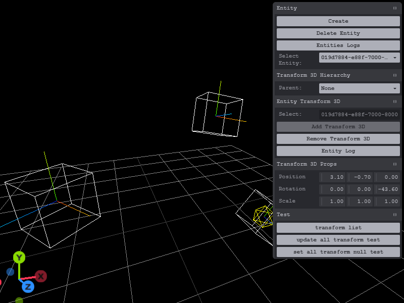

# spacetimedb-app-transform

# License: MIT

# Status:
- Work in progress.

# Program Languages:
- Typescript ( server )
- Javascript ( Client )

# SpaceTimeDB
 - 2.1.0

# Information:
  This project use SpacetimeDB that has server module to handle transform 2D or 3D hierarchy. The transform 2D or 3D will query to update parent to child matrix for position, rotation and scale.

  With the help of Grok A.I agent to handle the transform hierarchy matrix to make sure the math is working and render three.js test correctly.

## Transform 3D:
  Worked and tested the three.js on server to make sure the matrix match the parent and child relate world position, rotate and scale. It was translate to pure math matrix.

## Transform 2D:
- https://github.com/Lightnet/spacetimedb-app-transform2d

  Made this project repo for stand alone for better testing. It can be use for place holder sample project. Almost all basic features of transform set and set handers. It use math on the server side. Three.js will have be translate 2D to 3D.

# Transform Hierarchy:
  To able to use three.js matrix and helper to to test transform hierarchy for 2D and 3D. Then go math matrix was easy and hard. 
  
  There are different way to handle transform hierarchy in client since it use matrix so mesh update matrix are disable for 3D but 2D it is not disble. 
  
  The SpaceTimeDB use webassembly server module format. So it can't use nodejs but use internal api calls. SpaceTimeDB has Reducer api function extend class can't have too many nested functiuons only one layer. As it mentioned there fail rollback in case of fail query. It need to create, update, query and delete else it will fail to query database. 
  

```ts
 ctx.db.transform.entityId.update(transform)
```

- [ ] Schedule Tables
  - [x] sample move transform3d
    - just the test which can move but it effect all due just testing.
- [x] reducer (function for client to access)
- [ ] trigger event

## refs:
- https://spacetimedb.com/docs/databases/transactions-atomicity

## Animation:
  Work in progress. Note this is just simple move test. By using the Schedule Tables due to sandbox. It mean that javascript timer functions are disable but use SpaceTimeDB Schedule Tables.
  
# Screen Shot:


# Editor:
  The UI tool has the testing for position, rotation, quaternion, scale to update for box transform 2d and 3d. Using the Tweakpane for debug sync from the SpaceTimeDB.

## Features:
- [x] entity
  - [x] create entity
  - [x] delete entity and check for transform 3d and 2d to delete match entity id
- [x] transform 3d
  - [x] add 
  - [x] remove 
  - [x] parent
- [x] transform 2d
  - [x] add 
  - [x] remove 
  - [x] parent
- [x] ui select transform 3d / 2d
  - [x] position
  - [x] rotation
  - [x] scale
  - [x] parent
    - [x] using the reducer to update all transforms base on isDirty propagation.
- [x] select entity display yellow marker if transform 3d or 2d is added.
- [x] demo three js transform 3d hierarchy stand alone test.

# Server features:
- [x] still need to test more
- [x] transform 3D hierarchy
  - [x] set / get transform3d
  - [ ] set / get matrix ?
  - [x] set / get position 
  - [x] set / get quaternion 
  - [x] set / get rotation 
  - [x] set / get scale
  - [x] parent to child update. 
- [x] transform 2D hierarchy
  - [x] set / get transform3d
  - [ ] set / get  matrix
  - [x] set / get position
  - [x] set / get rotation
  - [x] set / get scale
  - [x] parent to child update.
- [x] reducer
  - update all transforms that has isDirty to update to propagation filter.
- [ ] schedule

# Config:
  Make sure the application database name match the server and client. Since using the ***spacetime dev*** command line to run development mode to watch and build.

## Client
```js
const DB_NAME = 'spacetime-app-transform';
```
## Server:
spacetime.json
```json
//...
"database": "spacetime-app-transform",
//...
```
spacetime.local.json
```json
//...
"database": "spacetime-app-transform",
//...
```

# Commands:
```
bun install
```
```
spacetime start
```
```
spacetime dev --server local
```
# SQL:
```
spacetime sql --server local spacetime-app-transform "SELECT * FROM entity"

spacetime sql --server local spacetime-app-transform "SELECT * FROM transform3d"

spacetime sql --server local spacetime-app-transform "SELECT * FROM transform2d"

```
 For query table in command line.

# SQL to text file:

```
spacetime sql --server local spacetime-app-transform "SELECT * FROM transform3d" > backup_your_table.txt

spacetime sql --server local spacetime-app-transform "SELECT * FROM transform2d" > backup_your_table.txt
```

# Delete
```
spacetime publish --server local spacetime-app-transform --delete-data
```
 In case bug and can't update table error.

# Credits:
- https://spacetimedb.com/docs
- Grok AI agent

# Server:
 - Note due to reducer have limited function call child to one to query. If more child to sub child it will not update the table. As it did say in docs.
 
## Tables:
```ts
export const entity = table(
  { 
    name: 'entity', 
    public: true,
  },
  {
    id: t.string().primaryKey(),
  }
);
```
```ts
export const transform3d = table(
  { 
    name: 'transform3d', 
    public: true,
  },
  {
    entityId: t.string().primaryKey(),
    parentId: t.string().optional(),
    isDirty:t.bool().default(true),
    position: Vect3,
    quaternion: Quat,
    scale: Vect3,
    localMatrix: t.array(t.f32()).optional(),
    worldMatrix: t.array(t.f32()).optional(),
  }
);
```
```ts
export const transform2d = table(
  { 
    name: 'transform2d', 
    public: true,
  },
  {
    entityId: t.string().primaryKey(),
    parentId: t.string().optional(),
    isDirty:t.bool().default(true),
    position: Vect2,
    rotation: t.f32(),
    scale: Vect2,
    localMatrix: t.array(t.f32()).optional(),
    worldMatrix: t.array(t.f32()).optional(),
  }
);
```

# Client api:
  Work in progress.

## Entity
  Having entity id tag string for handle add on components.

```
  Entity
   - Transform2D
   - Transform3D
```

### createEntity:
```js
  conn.reducers.createEntity({})
```
  Create blank entity.

### deleteEntity:
```js
  conn.reducers.deleteEntity({
    id:PARAMS.entityId
  });
```
  Delete Entity base on entityId. Check for any components to be delete as well.

## Transform 3D

### addEntityTransform3D:
```js
conn.reducers.addEntityTransform3D({
  id: PARAMS.entityId
});
```
  Entity add transform 3D.

```js
  conn.reducers.addEntityTransform3D({
    id: PARAMS.entityId, // required
    position:PARAMS.ph_position, // option {x,y,z}
    quaternion:PARAMS.ph_quaternion, // option {x,y,z,w}
    scale:PARAMS.ph_scale, // option // {x,y,z}
    parentId:"", // option // string //need to check exist.
  });
```
  This has option to set params.


### removeEntityTransform3D:
```js
conn.reducers.removeEntityTransform3D({
  id:PARAMS.entityId
})
```
  Entity remove transform 3D.

### setT3Pos
```js
conn.reducers.setT3Pos({
  id:PARAMS.entityId,
  x:PARAMS.t_position.x,
  y:PARAMS.t_position.y,
  z:PARAMS.t_position.z
})
```
  Transform 3D set local position.

### setT3Rot:
  Three js has the helper class and functions to make rotate degree (x, y, z) to 
  Quaternion (x, y, z, w).
```js
conn.reducers.setT3Rot({
  id:PARAMS.entityId,
  x:PARAMS.t_rotation.x,
  y:PARAMS.t_rotation.y,
  z:PARAMS.t_rotation.z,
});
```
- This use degree to convert on the server side.

### setT3Quat:
Quaternion (x, y, z, w)
```js
conn.reducers.setT3Quat({
  id:PARAMS.entityId,
  x:rotation.x,
  y:rotation.y,
  z:rotation.z,
  w:rotation.w
})
```

### setT3Scale:
```js
conn.reducers.setT3Scale({
  id:PARAMS.entityId,
  x:PARAMS.t_scale.x,
  y:PARAMS.t_scale.y,
  z:PARAMS.t_scale.z
})
```

### getT3Local:
```js
  const transform2d = await conn.procedures.getT3Local({
    id:PARAMS.entityId
  })
  console.log("local transform2d: ", transform2d)
```
```
matrix: (16) [...]
position: {x: 1, y: 0.6, z: 0}
quaternion: {x: 0, y: 0, z: 0, w: 1}
scale: {x: 1, y: 1, z: 1}
```

### getT3LocalMatrix:
```js
const mat = await conn.procedures.getT3LocalMatrix({
    id:PARAMS.entityId
  })
  console.log("local mattix: ", mat)
```


### getT3LocalPos:
```js
  const pos = await conn.procedures.getT3LocalPos({
    id:PARAMS.entityId
  })
  console.log("local postion: ", pos)
```

### getT3LocalQuat:
```js
  const quat = await conn.procedures.getT3LocalQuat({
    id:PARAMS.entityId
  })
  console.log("local quat: ", quat)
```

### getT3LocalScale:
```js
  const scale = await conn.procedures.getT3LocalScale({
    id:PARAMS.entityId
  })
  console.log("local scale: ", scale)
```

### getT3LocalRot:
```js
  const rotate = await conn.procedures.getT3LocalRot({
    id:PARAMS.entityId
  })
  console.log("local rotate: ", rotate)
```

### getT3World:
```js
  const t3d = await conn.procedures.getT3World({
    id:PARAMS.entityId
  })
  console.log("world transform3d: ", t3d)
```

### getT3WorldMatrix:
```js
  const mat = await conn.procedures.getT3WorldMatrix({
    id:PARAMS.entityId
  })
  console.log("world mattix: ", mat)
```

### getT3WorldPos:
```js
  const pos = await conn.procedures.getT3WorldPos({
    id:PARAMS.entityId
  })
  console.log("local pos: ", pos)
```
### getT3WorldQuat:
```js
  const quat = await conn.procedures.getT3WorldQuat({
    id:PARAMS.entityId
  })
  console.log("local quat: ", quat)
```
### getT3WorldRot:
```js
  const tranform3d = await conn.procedures.getT3WorldRot({
    id:PARAMS.entityId
  })
  console.log("local tranform3d: ", tranform3d)
```

### getT3WorldScale:
```js
  const scale = await conn.procedures.getT3WorldScale({
    id:PARAMS.entityId
  })
  console.log("local scale: ", scale)
```

### updateAllTransform3Ds:
```js
conn.reducers.updateAllTransform3Ds();
```
  This will handle update for parent to child matrix4.

### updateAllTransform3DsNull:
```js
conn.reducers.updateAllTransform3DsNull();
```
  This is to clear out the matrix for tests.

## Transform 2D:
 There are get and set function for transform 2D. Can get and set for parent, transform2d (all input and output but not parent id), position, rotation and scale. As well other debug call functions.

 Work on short names for dev build.
 
### setT2Parent:
```js
  conn.reducers.setT2Parent({
    id:PARAMS.entityId,
    parentId:id // parentId
  })
```

### setT2Local:
```js
conn.reducers.setT2Local({
    id:PARAMS.entityId, 
    position:PARAMS.t2_position, // {x:0,y:0}
    rotation:PARAMS.t2_rotation, 
    scale:PARAMS.t2_scale, // {x:1,y:1}
  });
```

### setT2Pos:
```js
  conn.reducers.setT2Pos({
    id:PARAMS.entityId,
    x:PARAMS.t2_position.x,
    y:PARAMS.t2_position.y
  });
```

### setT2Rot:
```js
  conn.reducers.setT2Rot({
    id:PARAMS.entityId,
    rotation: PARAMS.t2_rotation // degree
  });
```

### setT2Scale:
```js
  conn.reducers.setT2Scale({
    id:PARAMS.entityId,
    x:PARAMS.t2_scale.x,
    y:PARAMS.t2_scale.y
  })
```

### getT2Parent:
```js
  let _parentId = await conn.procedures.getT2Parent({
    id:PARAMS.entityId
  });
  console.log("Parent Id:", _parentId)
```
### getT2Local:
```js
  let t2d = await conn.procedures.getT2Local({
    id:PARAMS.entityId
  });
  console.log("getLocalTransform2D:", t2d);
  // {position:{x:0,y:0},rotation:0,scale:{x:1,y:1}}
```

### getT2LocalMatrix:
```js
  const matrix = await conn.procedures.getT2LocalMatrix({
    id:PARAMS.entityId
  })
  console.log("local matrix: ", matrix)
```

### getT2LocalPos:
```js
  let pos = await conn.procedures.getT2LocalPos({
    id:PARAMS.entityId
  });
  console.log("pos:", pos)
```

### getT2LocalRot:
```js
  let rot = await conn.procedures.getT2LocalRot({
    id:PARAMS.entityId
  });
  console.log("rot:", rot)
```

### getT2LocalScale:
```js
  let scale = await conn.procedures.getT2LocalScale({
    id:PARAMS.entityId
  });
  console.log("scale:", scale)
```

### getT2World:
```js
  let t2d = await conn.procedures.getT2World({
    id:PARAMS.entityId
  });
  console.log("getWorldTransform2D:", t2d);
  // {position:{x:1,y:1},rotation:0,scale:{x:1,y:1}}
```

### getT2WorldMatrix:
```js
  let matrix = await conn.procedures.getT2WorldMatrix({
    id:PARAMS.entityId
  });
  console.log("world matrix: ", matrix)
```

### getT2WorldPos:
```js
  let pos = await conn.procedures.getT2WorldPos({
    id:PARAMS.entityId
  });
  console.log("pos:", pos)
```

### getT2WorldRot:
```js
  let rot = await conn.procedures.getT2WorldRot({
    id:PARAMS.entityId
  });
  console.log("rot:", rot)
```

### getT2WorldScale:
```js
  let scale = await conn.procedures.getT2WorldScale({
    id:PARAMS.entityId
  });
  console.log("scale:", scale)
```

### clearAllTransforms:
```js
  conn.reducers.clearAllTransforms();
```
  For debugging.